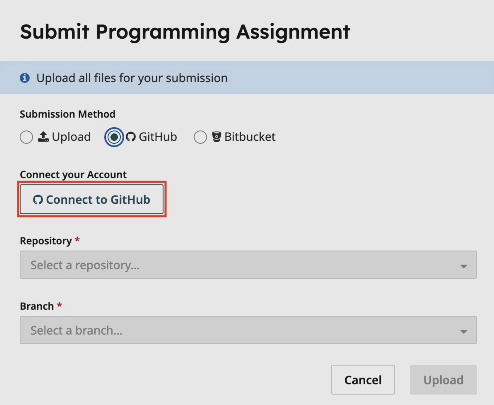
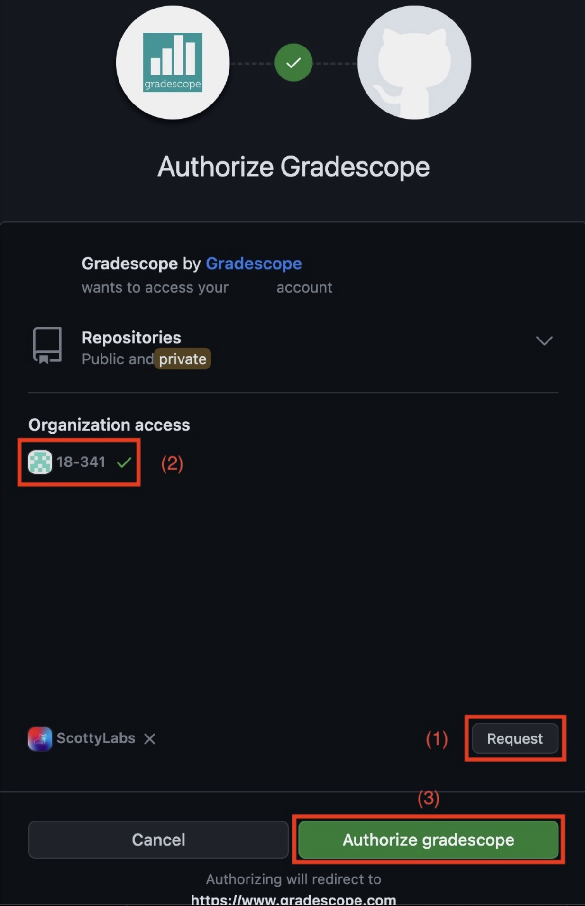
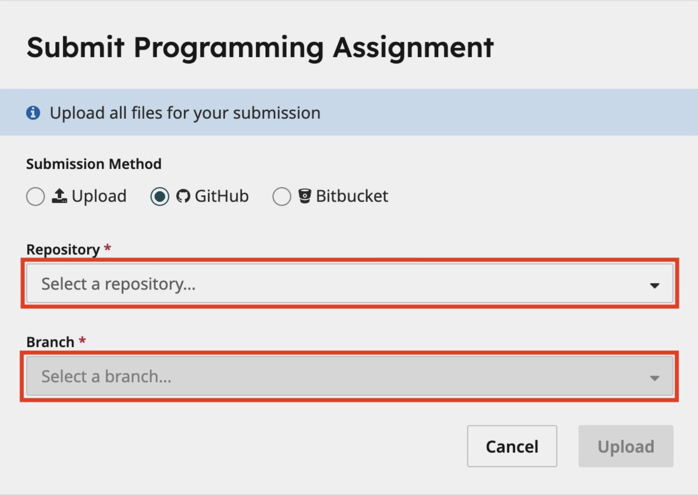
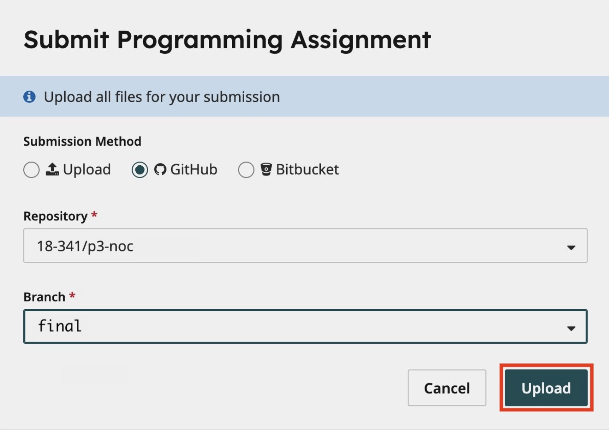

# Warmup

18-341: Fall Semester of 2025

## Objective and Overview

The purpose of this project is to brush off any dust that has accumulated on
your SystemVerilog skills.  It's as much about getting an FPGA programming
environment set up as anything else.  As such, this project is significantly
simpler than any other course project; and, therefore, worth far fewer points.

This is an **individual** project, to be done in simulation with VCS and on
your Boolean Board.

## Schedule and Scoring

Project value | 20 points
--- | ---
Project start | 25 August 2025
Project due | 27 August 2025 at 3:30pm
Drop dead date | 28 August 2025 at 3:30pm

If you have not uploaded anything by the drop dead date, we will assume you
are no longer in the course. Why? Because the syllabus says you must *attempt
every project.* Not uploading anything and not showing up to explain what
you’ve done is not attempting the project — see the syllabus for details.

By the way, using your grace day on Project 1 is a very bad idea.

You will have a demonstration of your system in the days soon after the
deadline.  Stay tuned for details on how to sign up for a demo slot.

## A Note about Collaboration

Project 1 is to be accomplished individually.  All work must be your own.

Hints from others can be of great help, both to the hinter and the hintee.
Thus, discussions and hints about the assignment are encouraged.  However, the
project must be coded and written up individually (you may not show, nor view,
any source code from other students).  We may use automated tools to detect
copying.

Don't forget the course policies about use of Generative AI.

Use Piazza to ask questions or come visit us during office hours (or email for
an appointment at another time).  We want to see you succeed, but you have to
ask for help.

## Background

Over the semester we’ll do several assignments (homeworks and/or
projects) that are to be implemented and demonstrated on the Boolean
Boards we’re giving you for the semester.  
The basic idea here is to (maybe) install the development software on
your computer, run it to develop the system described here, and turn
your code in, all before the due date. 

The software is available for Windows and Linux.  Download it at 
https://www.amd.com/en/products/software/adaptive-socs-and-fpgas/vivado.html.  
If you have a Mac (lucky you), you will have to
use a virtual machine (Parallels, VMware, etc).  You can, of course,
just use the computers in the HH-1305 cluster (the “240 lab”) as well. 
(Just don’t try to use them during 240 lab times!)  

## Assignment Overview

Go to the ECE Receiving Window (HH 1301) between 9-4 M-F
to pick up your Boolean Board kit.  BTW, you’ll be
returning it to the same place at the end of the semester in exchange
for a grade.

Use the invitation link provided on Piazza to access and clone your
GitHub repo.  The repo contains **sumitup.sv,**, **tatb.sv** and 
**Boolean341.xdc**.  **Boolean341.xdc** is a pin definition
file for your board.  Write a **p1.sv** file to combine these files,
together with possibly some other SV code and demonstrate the system
running on your board.  Hmm, more information needed.

The basic idea of the **sumitup** thread is to add up a series of numbers
provided at its input.  It is not complex at all.  This thread is fully
described in the textbook.  You will get sick of it, as we also will use it
as an example throughout the class.  It has a very simple protocol.
When the **go_l** signal is asserted, that indicates the first value is on the input. 
At each **clock** edge another value appears on the **inA** input.  However, when
there’s a zero on the **inA** input, that’s the last value and **done** should
immediately be asserted.  At that point, the **sum** output must be the sum of
all the values.  The **sumitup** thread is completely and correctly
specified in the **sumitup.sv** file you downloaded.  You will not need to
make any changes to the **sumitup** thread.  Obviously, there must be more
to this project, then.

Your main task is to write a “downstream thread” that captures the
calculated **sum** and holds it for display while the next sum is being
calculated.  All it does is wait for the **done** signal and then loads the
calculated sum into its own register.  The captured value is then
displayed on the lower two hex displays. 

The hardware testbench, which we provide, will generate a set of random
values and send them to your **sumitup** thread (assuming you’ve wired
everything together correctly).  When it’s done, it outputs what it
thinks is the 8-bit sum of the series of values, which you should
wire to the  **HEX5** and **HEX4** seven segment displays (on the
leftmost set of digits). Your sum should be displayed in **HEX1** and **HEX0.**  
Ensure the decimal points and the **HEX7/6** and **HEX3/2** digits are blank.

The
idea is that if you’ve interfaced and wired everything together
correctly, then whenever you press **BTN[0]**, a bunch of values are generated
and sent into the **sumitup** thread.  Hopefully, the same two 2-digit hex numbers
 are shown in the
left and right hex displays.  Also, in that case,
the testbench will provide a signal (that you'll hook to **LD[0]**) such
that the LED will light up when the values match.  You’ll need some
combinational logic to drive the displays (which you are free to re-use from
18-240).  

The testbench header looks like this:

```systemverilog
module tatb // header for our hardware testbench
  (input  logic       ck, done, reset_l, Button0,
   output logic [7:0] valueToinA, // connect this to sumitup's inA
                      tbSum,      // tb's sum for display
   output logic       go_l, 
                      L0,         // L0 indicating sums match
   input  logic [7:0] outResult); // your downstream thread's
                                  // output connected to tb
```

Just to make sure you've thought this through, let me ask a few questions. 
 
* Are you responsible for connecting **tbSum** to anything?  

* Your thread's output value will be connected to **outResult**, as noted in
the comments above.  Should it be connected to anything else?  

* Does the testbench handle the **LD[0]** connection, or do you have to do that?  

If you are unsure about any of these answers, come talk to us before you start hacking away.

## Testbench Operations

We use two of the buttons on the board to control the testbench's
operation.  **BTN[2]** is a reset and will put zeros in the display,
turn **LD[0]** off, and reset the FSM.  **BTN[0]** is used to start the
operation. Reset the board and it should show all zeros in the display. 
When you press and hold **BTN[0]**, the hardware testbench will send a
series of numbers to your **sumitup** thread at the blazing speed of 100
MHz.  You’ll see the sum of what the testbench sent in the upper hex
displays, and the result of what your code calculated in the lower hex
displays (this is the value captured by the downstream thread).  If the
two values are equal, **LD[0]** should light. When you let go of **BTN[0],**
the hardware testbench will zero its hex displays and your code will
keep displaying the calculated sum in the lower digits.  It will wait
for the next depressing of **BTN[0]** (which will not be depressing because
you’ll then get a whole new sum displayed). When you depress **BTN[0]**
again, a new series of numbers will be sent and displayed. Pushing
**BTN[2]** will reset so that all the displays are zero. Note that the
buttons are active low (they present a logic 0 when pressed).

Why is it called a hardware testbench? Because the testbench is
synthesized into hardware to do the operations mentioned above.  Most of
the testbenches you dealt with in 18-240 were simulation testbenches,
right?  See the difference?

## Some Other Things you Should Learn

There are several details about the devices on your board that I've
given here (buttons are active low, LEDs active high, etc).  Where did I
figure them out?  If you ever want to know about the components on the
Boolean board itself, check out the User Manual.  You can find it in on 
the website of the board manufacturer at https://www.realdigital.org/doc/02013cd17602c8af749f00561f88ae21
.  The manual is a fairly readable document that talks about all
of the components that go into making an FPGA board like the Boolean Board.  I
probably wouldn't read it straight through, but I certainly go to it
often when putting together a project and trying to get the components
to work correctly.  Please take a few minutes to page through it,
particularly the sections dealing with the components for this project: 

* GPIO

* Seven Segment Display

Also, the User Manual is one place to go to figure out what to type into
the third page of the Xilinx “New Project” wizard when it asks for an
FPGA device type.

## How To Turn In Your Solution

This semester we will be using
[Github Classroom](https://classroom.github.com/classrooms/31452665-18-341-fall25)
to hand-out as well as hand-in project code.  We will post invitation links on Piazza whenever a project is posted.  I suppose you already know that, else you wouldn't have
gotten this file from the repo.

Make sure to commit regularly and
provide informative messages, as this will help TAs immensely to provide
feedback.

When you have finished this project you should:


1. Create a branch of the commit you want to submit, naming it as your final commit.
   Commit it and push it to GitHub.  Sure, and tag it as well.
  ```sh
$ git branch gradescope_final
$ git checkout gradescope_final
$ git add --all
$ git commit -m "My final submission.  Yay, I'm done!"
$ git push -u origin gradescope_final
$ git tag -a final -m "Final submission for 18341 P1"
$ git push --tags  
  ```

2. Log onto Gradescope and select the P1: Warmup assignment.



3. Submit via GitHub by linking your GitHub account.  I'm assuming you have a
   GitHub account; if not, you should get one.  You will only need to do
   this step once.  Future projects will already have this linkage in place.
   
   (a) **Please ensure the 18-341 class is selected,** otherwise you won't
       be able to select your repository.  You may have to press "Request,"
       and then you should see the checkmark next to the 18-341 organization.


       
4. Select the repository you want to submit.



5. Select the "gradescope_final" branch that you want to submit.

6. Press submit!



7. Before your checkoff demonstration, you must clone the repo onto the AFS
   machine where you intend to demo.  Do not count on SFTP to sync for you.  
   Instead, you must actually use git to clone.

## Demos and Late Penalty

We will have demo times outside of class times on or near the due date.  Since
we will demo from the files in your repo, it is possible that you’ll demo on a
following day.

**Define Late:**  Lateness is determined by the file dates of your repo.

**Grace Day:**  You may use your grace day to turn in the solution up to 24
hours late.  If you do not intend to use a grace day (or have already used
yours), make sure you have something in the repo (and have pushed the repo) at
the deadline to avoid getting a zero on this project.
